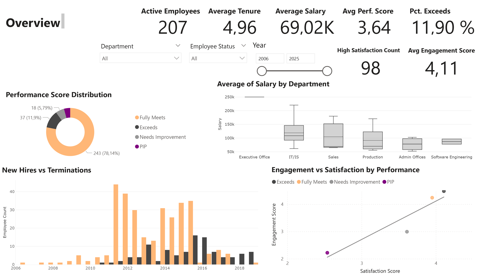
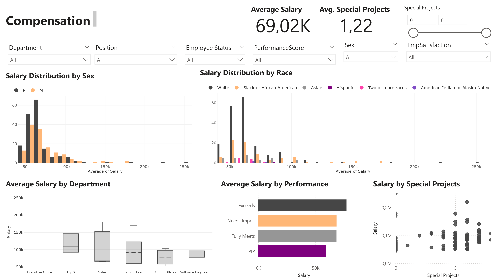
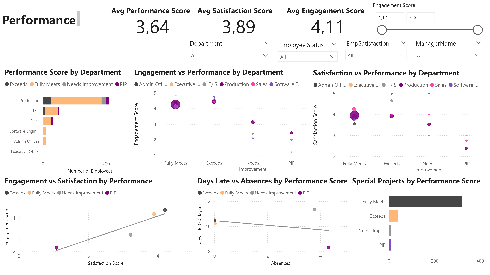
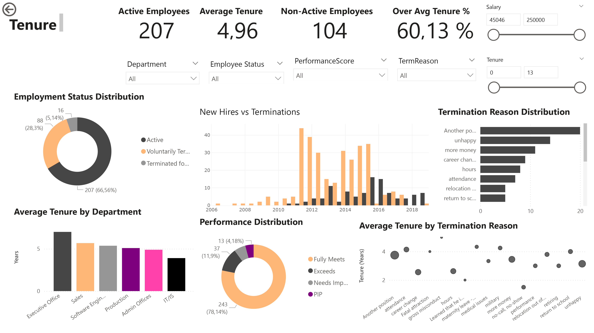
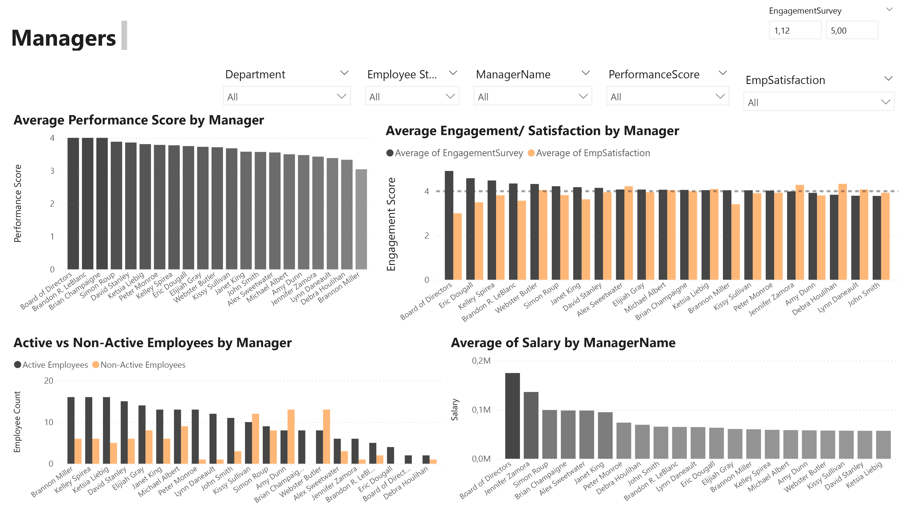

# 👩‍💼 Proyecto de HR Analytics Dashboard
Este proyecto analiza datos de empleados recogidos por un departamento de Recursos Humanos utilizando Python para la extracción, limpieza y carga a BigQuery, donde se da transforman los datos, y Power BI para el análisis avanzado y creación de un reporte con diferentes dashboards interactivos. Todo esto tiene como objetivo obtener métricas que apoyen la toma de decisiones estratégicas en RRHH. 

El flujo de trabajo combina:
* Extración, limpieza y subida de datos a BigQuery usando Python.
* Queries en BigQuery para corregir el formato de los datos y para crear tablas de hechos y dimensiones.
* Creación de métricas y columnas con DAX para calcular KPIs y construir los diversos dashboards finales en Power BI.

---
## 📌 Estructura del Proyecto
```
/hr-analytics-dashboard
│── /data
│   ├── /datamodel
│   │   ├── Demographics.csv
│   │   ├── Employees.csv		
│   │   ├── EmploymentStatus.csv
│   │   ├── Jobs.csv
│   │   ├── Managers.csv
│   │   ├── Performance.csv
│   ├── RawData.csv          
│   ├── data.csv		# Dataset original
│── /notebooks
│   ├── ETL.pynb
│── /reports
│   ├── hr-report.pbix
│   ├── hr-report.pdf
│   ├── /images
│   │   ├── Compensation_Dashboard.png
│   │   ├── Demographics_Dashboard.png
│   │   ├── Managers_Dashboard.png
│   │   ├── Overview_Dashboard.png
│   │   ├── Performance_Dashboard.png
│   │   ├── Tenure_Dashboard.png
│── /sql-queries
│   ├── data-model.sql       
│   ├── format-columns.sql  
│── README.md
```

---
## 📊 1. Preparación de Datos (Python & BigQuery)
* Desde un notebook en Python, se conecta a este repositorio para obtener el dataset [data.csv](data/data.csv).
* Se realiza limpieza inicial de datos y se crea un dataset y una tabla en BigQuery, donde se sube los datos limpiados.
* Las queries de la carpeta sql-queries incluyen:
	* Corrección de formatos erróneos (fechas, identificadores).  
	* Separación de RawData en tabla de hechos y tablas de dimensiones. 

📌 Esto permite disponer de un modelo de datos limpio y estructurado para análisis posterior en Power BI.

---
## ⚙️ 2. Dashboard en Power BI

El dashboard interactivo se creó en Power BI, usando datos conectados directamente desde BigQuery con:
* Estructuración del modelo de datos
* Creación de métricas y columnas calculadas para generar KPIs útiles para el departamento de Recursos Humanos.

El report completo incluye los siguientes dashboards:
* **Overview Dashboard** → Métricas globales de empleados.
* **Demographics Dashboard** → Género, edad, estado civil, ciudadanía y diversidad.
* **Compensation Dashboard** → Sueldos, proyectos adicionales y equidad salarial.
* **Performance Dashboard** → Performance, satisfacción y engagement.
* **Tenure & Term Dashboard** → Antigüedad, contratacion y causas de salida.
* **Managers Dashboard** → Performance, engagement y salario por Manager.

📷 ### **Dashboard Previews**

#### 🔹 **Overview Dashboard**



#### 🔹 **Demographics Dashboard**


#### 🔹**Compensation Dashboard**



#### 🔹**Performance Dashboard**



#### 🔹**Tenure Dashboard**



#### 🔹**Managers Dashboard**



---
## 📈 3. Insights Clave del Análisis
### **1. Demografía**

* Género balanceado globalmente.
* Edad concentrada entre 30–45 años, teniendo una media de edad de, aproximadamente, 46 años.
* Diversidad racial presente, aunque con concentraciones en ciertos roles.

### **2. Compensación**

* Salarios muy dispersos entre posiciones y departamentos.
* A más proyectos especiales, mayor es la posibilidad de obtener mayor salario.
* Hay una pequeña diferencia entre el salario de los empleados con performance "Exceeds" y "PIP". 
* No se observan grandes brechas de género o edad.

**Conclusión:** la compensación va ligada principalmente a las responsabilidades adicionales, más que al propio desempeño de los empleados.

### **3. Performance**

* Cerca del 80% de empleados tienen una puntuación de "Fully Meets" (4/5).
* El departamento de Producción cuenta con el mayor número de empleados. Al ser más, la dispersión es mayor.
* Hay diferencias de desempeño en base al manager. El liderazgo es un factor clave.

* La satisfacción promedio es de 3,89 sobre 5, mientras que la puntuación promedia de engagement está algo por encima del 4.
* El engagement es un mejor predictor de desempeño que la satisfacción.
* Departamentos con menor engagement tienen mayor número de salidas.

* El mayor número de ausencias está ligado a perfiles con menor rendimiento.
* Las tardanzas también pueden ser un indicador de desmotivación, ya que están ligadas al bajo engagement.

**Conclusión:** la cultura de equipo y el liderazgo pesan más que salario o antigüedad.

### **4. Tenure (Antigüedad)**

* Alrededor del 70% de los empleados analizados siguen activos.
* Duración media de casi 5 años en la empresa.
* Más de un 60% de los empleados lleva trabajando más de 5 años en la empresa.
* No hay relación directa entre tenure y desempeño.
* Alta rotación en departamentos con bajo engagement.
* Cuando el salario supera 110k, se ve un aumento en Tenure.
* Managers específicos concentran bajas por bajo desempeño.
* Ingresos/salidas muestran picos de contratación en ciertos años → clave para planear sucesión.

* **Early tenure:** salidas por insatisfacción o bajo performance.
* **Mayor tenure:** salidas por otras oportunidades.

### **5. Managers/ Departamentos**

* Los managers de Producción son un foco de riesgo: baja satisfacción y alta rotación.
* Los managers de Ventas y Administración tienen empleados con engagement alto y baja rotación.
* Los empleados de IT tienen tenures cortas, aunque no haya problemas de performance.
* Los managers de Software Engineering cuentan con un departamento con un engagement y satisfacción altos, pero con una rotación alta por otras oportunidades.

---
### Conclusiones Estratégicas
* El engagement es el verdadero driver de performance, más que salario o antigüedad.
* La compensación premia proyectos, más que el propio desempeño → riesgo de desmotivación en top performers.
* Los managers marcan la diferencia en desempeño y rotación → HR debe monitorear métricas por manager.
* La rotación se resume en: en early tenure por bajo performance; en perfiles senior por fuga de talento.
* La puntualidad (tardanzas) funciona como indicador del compromiso → métrica preventiva clave.
---
## 📥 4. Instalación y Uso

### Descargar el Repositorio

```
git clone https://github.com/angelfergar/hr-analytics-dashboard.git
cd hr-analytics-dashboard
```

### Reproducir el análisis

1. Usar el notebook [/notebooks/ETL.ipynb](/notebooks/ETL.ipynb) para:
   * Descargar el dataset desde GitHub.
   * Limpiar los datos.
   * Subir la tabla RawData a BigQuery.

2. En BigQuery:
   * Ejecutar las queries de `/sql-queries` para dar formato a los datos y crear las tablas limpias y dimensionales.

3. Abrir el archivo Power BI:
   * [/dashboards/hr-report.pbix](/dashboards/hr-report.pbix)
   * Explorar los dashboards interactivos con KPIs de Recursos Humanos.

---
## 📊 5. Resultados Clave
* El análisis confirma que liderazgo y engagement son los principales motores de performance.
* La rotación se explica por factores distintos según la antigüedad, lo que abre espacio a estrategias diferenciadas.
* La compensación actual puede generar inequidades percibidas al no premiar a top performers.
* La empresa cuenta con una plantilla madura y diversa, aunque con sesgos en algunos departamentos.
* La puntualidad y el engagement pueden usarse como métricas preventivas de riesgo de fuga de talento.
---
## 🤝 6. Contribución

¡Sugerencias y mejoras son bienvenidas! 🚀

📌 Desarrollado por: **Ángel Fernández**

✉️ **Contacto:** anfernagar@gmail.com
